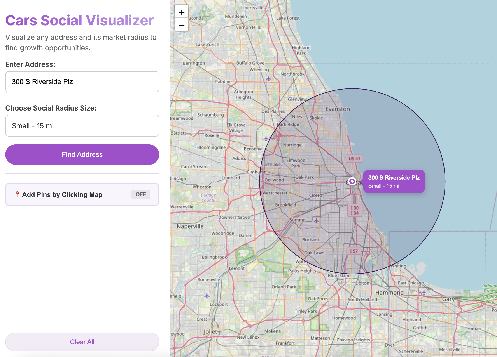

# Cars Social Visualizer

A simple interactive map tool to visualize addresses and their market radius to find growth opportunities.

 

## 🌟 Features

- **Address Search**: Search for any address and visualize it on an interactive map
- **Radius Visualization**: Choose between small (15 miles) or large (30 miles) market radius
- **Click-to-Add Mode**: Toggle on to place multiple pins by clicking anywhere on the map
- **Smart Notifications**: Visual feedback for all user actions
- **Delete Individual Pins**: Click on any radius circle to remove it
- **Multiple Locations**: Add and visualize multiple addresses simultaneously
- **Responsive Design**: Works seamlessly on desktop, tablet, and mobile devices

## 🚀 Live Demo

Visit the live application: [https://internetjen.github.io/social-radius-visualizer/](https://internetjen.github.io/social-radius-visualizer/)

## 📸 Screenshots

### Main Interface
The clean, intuitive interface makes it easy to visualize market coverage.

### Click-to-Add Mode
Toggle the feature to quickly add multiple locations by clicking on the map.

## 🛠️ Technologies Used

- **HTML5** - Semantic markup structure
- **CSS3** - Modern styling with CSS variables and animations
- **JavaScript (ES6+)** - Interactive functionality
- **Leaflet.js** - Interactive map library
- **OpenStreetMap** - Free map tiles
- **Nominatim API** - Geocoding and reverse geocoding

## 📦 Installation

### Run Locally

1. Clone the repository:
   ```bash
   git clone https://github.com/internetjen/social-radius-visualizer.git
   ```

2. Navigate to the project directory:
   ```bash
   cd social-radius-visualizer
   ```

3. Open `index.html` in your browser:
   ```bash
   # On macOS
   open index.html
   
   # On Linux
   xdg-open index.html
   
   # On Windows
   start index.html
   ```

   Or use a local server (recommended):
   ```bash
   # Python 3
   python -m http.server 5500
   
   # Node.js (with http-server)
   npx http-server
   ```

4. Visit `http://localhost:5500` in your browser

## 📖 Usage

### Basic Usage

1. **Search for an Address**
   - Enter an address in the search field
   - Click "Find Address" or press Enter
   - The map will fly to the location and place a pin

2. **Choose a Radius**
   - After searching for an address, select a radius size (Small - 15 mi or Large - 30 mi)
   - A circle will appear showing the coverage area

3. **Add Multiple Locations**
   - Toggle "Add Pins by Clicking Map" to ON
   - Click anywhere on the map to add additional pins
   - Each click will reverse-geocode the location and add a new pin

4. **Delete a Pin**
   - Click on any radius circle
   - A delete button (×) will appear at the center
   - Click the delete button to remove that location

5. **Clear All**
   - Click "Clear All" to remove all pins and start fresh

### Visual Feedback

The app provides helpful notifications:
- ✓ **"Click-to-add is turned ON"** - When enabling click-to-add mode
- ✓ **"Click-to-add is turned OFF"** - When disabling click-to-add mode
- ! **"Turn on 'Add Pins by Clicking Map' to place pins"** - Reminder when clicking the map with the feature disabled

All notifications auto-hide after 3 seconds.

## 🗂️ Project Structure

```
social-radius-visualizer/
├── index.html              # Main HTML file
├── styles.css              # Styles and animations
├── csRadiusVisualizer.js   # JavaScript functionality
├── README.md               # This file
└── .gitignore             # Git ignore file
```

## 🔧 Configuration

### Geocoding API

This project uses the free Nominatim API for geocoding. Please be aware of their usage policy:
- Maximum 1 request per second
- Include a valid User-Agent or Referer header
- Consider using their paid service for heavy usage

For production use, consider:
- [Google Geocoding API](https://developers.google.com/maps/documentation/geocoding)
- [Mapbox Geocoding API](https://docs.mapbox.com/api/search/geocoding/)
- Self-hosted Nominatim instance

### Dealership Search (Optional)

The code includes a placeholder for Google Places API dealership search. To enable it:

1. Get a Google Places API key
2. Replace `'YOUR_SECURED_API_KEY_HERE'` in `csRadiusVisualizer.js`
3. Uncomment or configure the dealership search functionality

## 🐛 Known Issues

- **Rate Limiting**: Heavy usage may trigger Nominatim rate limits. Wait a few seconds between searches if you encounter issues.
- **Mobile Performance**: Very large numbers of pins (50+) may cause performance issues on mobile devices.

## 🚀 Future Enhancements

Potential features for future releases:

- [ ] Export pin data to CSV
- [ ] Save/load sessions with localStorage
- [ ] Share map via URL with query parameters
- [ ] Print-friendly map view
- [ ] Distance measurement between pins
- [ ] Population density overlay


## 📝 License

This project is licensed under the MIT License - see below for details:

```
MIT License

Copyright (c) 2024 [Your Name]

Permission is hereby granted, free of charge, to any person obtaining a copy
of this software and associated documentation files (the "Software"), to deal
in the Software without restriction, including without limitation the rights
to use, copy, modify, merge, publish, distribute, sublicense, and/or sell
copies of the Software, and to permit persons to whom the Software is
furnished to do so, subject to the following conditions:

The above copyright notice and this permission notice shall be included in all
copies or substantial portions of the Software.

THE SOFTWARE IS PROVIDED "AS IS", WITHOUT WARRANTY OF ANY KIND, EXPRESS OR
IMPLIED, INCLUDING BUT NOT LIMITED TO THE WARRANTIES OF MERCHANTABILITY,
FITNESS FOR A PARTICULAR PURPOSE AND NONINFRINGEMENT. IN NO EVENT SHALL THE
AUTHORS OR COPYRIGHT HOLDERS BE LIABLE FOR ANY CLAIM, DAMAGES OR OTHER
LIABILITY, WHETHER IN AN ACTION OF CONTRACT, TORT OR OTHERWISE, ARISING FROM,
OUT OF OR IN CONNECTION WITH THE SOFTWARE OR THE USE OR OTHER DEALINGS IN THE
SOFTWARE.
```

## 👏 Acknowledgments

- [Leaflet.js](https://leafletjs.com/) - Open-source JavaScript library for interactive maps
- [OpenStreetMap](https://www.openstreetmap.org/) - Free, editable map of the world
- [Nominatim](https://nominatim.org/) - Open-source geocoding service
- [Inter Font](https://fonts.google.com/specimen/Inter) - Beautiful, modern typeface

## 📧 Contact

**Project Maintainer**: [Your Name]
- GitHub: [@internetjen](https://github.com/internetjen)
- Project Link: [https://github.com/internetjen/social-radius-visualizer](https://github.com/internetjen/social-radius-visualizer)

## 🌟 Support

If you find this project helpful, please consider:
- Giving it a ⭐ on GitHub
- Sharing it with others
- Reporting bugs or suggesting features

---

**Made with 💜 by Jennifer Arboleda**